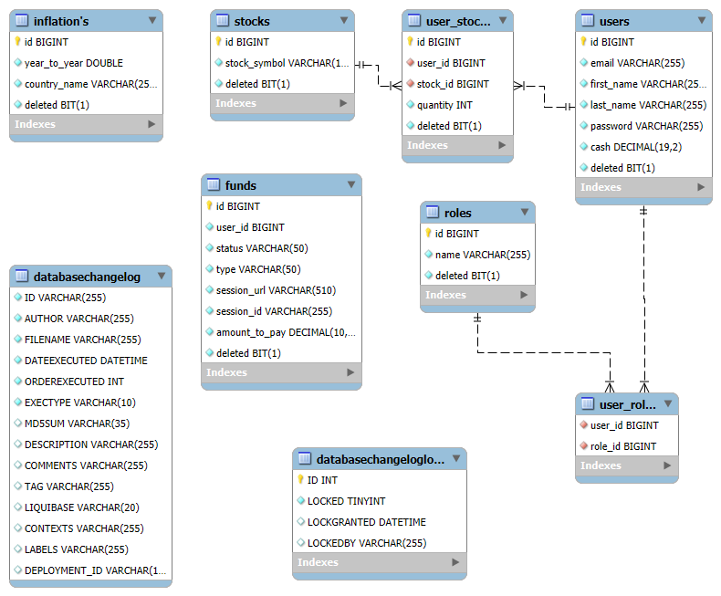

# Investment-Portfolio API

The **Investment-Portfolio API** offers users a comprehensive platform for managing investments, tracking stock portfolios, checking inflation rates, and securely handling payments through Stripe integration. This API supports both users and administrators, ensuring accurate and secure portfolio management with a robust set of features.

## Technologies Used

- **Spring Boot 3.3.3**: Simplified application development.
- **Spring Security**: Secures the API with authentication and authorization.
- **Spring Data JPA**: Manages data persistence using the Java Persistence API.
- **JWT (JSON Web Token)**: Provides stateless authentication.
- **MapStruct**: Efficient DTO-to-Entity mapping.
- **Swagger (Springdoc OpenAPI)**: Automatically generates API documentation.
- **Liquibase**: Database version control.
- **Testcontainers**: Integration testing with Docker containers.
- **MySQL**: Production database for persistent data storage.
- **H2 Database**: In-memory database for testing purposes.
- **Stripe**: Payment processing integration.
- **SerpApi**: Retrieves Google Search results for financial data.
- **Lombok**: Reduces boilerplate code via annotations.
- **Checkstyle**: Enforces coding standards.
- **Telegram API**: Sends notifications to admins, such as alerts for fund withdrawals.

---

## API Setup Instructions
To integrate and test APIs such as Stripe, SerpApi, and Telegram, follow the steps below to create and manage your own API keys:
1. Stripe API
- Create a Stripe Account:
  - Go to the Stripe website and sign up for an account.
- Generate Secret Key:
    - Once logged in, navigate to the API keys section (usually under "Developers"). Generate and copy the Secret Key (e.g., sk_test_... for testing purposes).
2. SerpApi
- Create a SerpApi Account:
  - Visit SerpApi and sign up for an account.
- Get Your Private API Key:
    - After logging in, go to your dashboard and copy your Private API Key for authentication in your code.
3. Telegram Bot API
- Create a Telegram Bot:
  - Open Telegram and chat with BotFather.
- Create a New Bot:
  - Use the command /newbot and follow the steps to create a bot.
- Save Your API Key:
  - After the bot is created, BotFather will provide an API token. Save this token to use in your application.
4. Test with GPW Stocks (Warsaw Stock Exchange)
- For testing purposes, it is recommended to use stocks from the GPW (Giełda Papierów Wartościowych) like:
  - KGH (KGHM Polska Miedź S.A.)
  - PKN (PKN Orlen S.A.)
  - or other GPW-listed companies.
#### (copy your keys to application.properties)
---

## Architecture Overview

The API is structured around modular controllers handling key business domains:
- **Funds Management**: Handles user payments via Stripe and notifies admins about withdrawals via Telegram.
- **Inflation Service**: Provides and updates inflation data.
- **Portfolio Management**: Manages user portfolios (buy, sell stocks).
- **Stock Management**: Administers stock data.
- **User Management**: Manages user profiles and roles.
- **Investment Calculator**: Offers investment forecasting, with or without inflation adjustments.

### Investment Calculator Controller

The **Investment Calculator Controller** is responsible for calculating the future value of investments, both with and without adjusting for inflation. It supports single payments and recurring contributions.

- **Single Payment Calculations**:
  - **Without Inflation**: Provides the future value of a one-time investment.
  - **With Inflation**: Adjusts for inflation in calculating the future value of a one-time investment for a specific country.

- **Recurring Contribution Calculations**:
  - **Without Inflation**: Computes the future value of investments made regularly (e.g., monthly).
  - **With Inflation**: Adjusts for inflation in calculating the future value of regular investments for a specific country.

---

## API Endpoints

### Funds Controller
- **POST** `/funds/add/{amount}`: Adds funds to a user's account (Stripe integration).
- **GET** `/funds/success/{sessionId}`: Verifies a successful payment session.
- **GET** `/funds/cancel/{sessionId}`: Handles payment cancellations.
- **POST** `/funds/withdrawal/{amount}`: Withdraws funds and notifies admin via Telegram.

### Inflation Controller
- **GET** `/inflation/my`: Retrieves the inflation rate for a specific country.
- **GET** `/inflation/all`: Retrieves all inflation data from the database.
- **PUT** `/inflation/add-new`: Adds new inflation data (Admin only).
- **POST** `/inflation/update`: Updates inflation data (Admin only).

### Investment Calculator Controller
- **GET** `/count-it-up/one-payment/{rateOfReturnInPercent}/{years}`: Calculates investment value (no inflation).
- **GET** `/count-it-up/one-payment/{inflationCountry}/{rateOfReturnInPercent}/{years}`: Inflation-adjusted investment value.
- **GET** `/count-it-up/many-times/{perMonth}/{rateOfReturnInPercent}/{years}`: Investment value with monthly contributions.
- **GET** `/count-it-up/many-times/{inflationCountry}/{perMonth}/{rateOfReturnInPercent}/{years}`: Inflation-adjusted with monthly contributions.

### Portfolio Controller
- **GET** `/portfolio/me`: Retrieves the current user's stock portfolio.
- **POST** `/portfolio/buy/{stockId}/{quantity}`: Buys stocks for the user's portfolio.
- **PUT** `/portfolio/sell/{stockId}/{quantity}`: Sells stocks from the user's portfolio.
- **GET** `/portfolio/me/portfolio-value`: Returns the total value of the user's portfolio (cash + stocks).

### Stock Controller
- **GET** `/stocks/all`: Retrieves all available stocks.
- **POST** `/stocks/add-new`: Adds a new stock (Admin only).
- **POST** `/stocks/add-new/force`: Adds a stock without validation (Admin only).

### Users Controller
- **GET** `/users/me`: Retrieves the authenticated user's profile.
- **PUT** `/users/me`: Updates the authenticated user's profile.

---

## Data Models

### Funds

Represents user payment sessions, tracking details and status, integrated with Stripe.

| Field        | Type       | Description                                       |
|--------------|------------|---------------------------------------------------|
| `id`         | Long       | Auto-generated primary key                        |
| `userId`     | Long       | ID of the user associated with the payment        |
| `status`     | Enum       | Payment status: PENDING, PAUSED, PAID             |
| `type`       | Enum       | Payment type: ADDING, FINE                        |
| `sessionUrl` | String     | Stripe session URL                                |
| `sessionId`  | String     | Unique Stripe session ID                          |
| `amountToPay`| BigDecimal | Payment amount (precision: 10, scale: 2)          |
| `isDeleted`  | Boolean    | Soft delete flag (`false` = active)               |

### Inflation

Stores inflation data for various countries.

| Field          | Type    | Description                            |
|----------------|---------|----------------------------------------|
| `id`           | Long    | Auto-generated primary key             |
| `yearToYear`   | Double  | Year-over-year inflation rate          |
| `countryName`  | String  | Country name (unique)                  |
| `isDeleted`    | Boolean | Soft delete flag (`false` = active)    |

### Role

Defines user roles in the system.

| Field      | Type    | Description                            |
|------------|---------|----------------------------------------|
| `id`       | Long    | Auto-generated primary key             |
| `name`     | Enum    | Role name: ROLE_USER, ROLE_ADMIN       |
| `isDeleted`| Boolean | Soft delete flag (`false` = active)    |

### Stock

Represents available stocks in the system.

| Field        | Type    | Description                            |
|--------------|---------|----------------------------------------|
| `id`         | Long    | Auto-generated primary key             |
| `stockSymbol`| String  | Stock ticker symbol (unique)           |
| `isDeleted`  | Boolean | Soft delete flag (`false` = active)    |

### User

Represents registered users in the system.

| Field       | Type       | Description                                       |
|-------------|------------|---------------------------------------------------|
| `id`        | Long       | Auto-generated primary key                        |
| `email`     | String     | User's email (unique)                             |
| `password`  | String     | User's hashed password                            |
| `firstName` | String     | User's first name                                 |
| `lastName`  | String     | User's last name                                  |
| `cash`      | BigDecimal | Available cash balance                            |
| `stocks`    | Set<UserStock> | Stocks owned by the user                      |
| `roles`     | Set<Role>  | Roles assigned to the user                        |
| `isDeleted` | Boolean    | Soft delete flag (`false` = active)               |

### UserStock

Represents the relationship between users and their stock holdings.

| Field       | Type   | Description                               |
|-------------|--------|-------------------------------------------|
| `id`        | Long   | Auto-generated primary key                |
| `user`      | User   | User who owns the stock                   |
| `stock`     | Stock  | Stock owned by the user                   |
| `quantity`  | Integer| Number of shares owned                    |
| `isDeleted` | Boolean| Soft delete flag (`false` = active)       |

### Enums

- **PaymentType**: Describes payment types:
  - `ADDING`: Funds addition.
  - `FINE`: Fine payment.
  
- **RoleName**: Describes user roles:
  - `ROLE_USER`: Regular user role.
  - `ROLE_ADMIN`: Admin role with extra privileges.

- **Status**: Payment status:
  - `PENDING`: Payment initiated but incomplete.
  - `PAUSED`: Payment temporarily paused.
  - `PAID`: Payment successfully completed.

---

## Setup Instructions

### Prerequisites
- Java 17
- Docker

### Setup Steps

1. Check if you have Git installed: `git --version`
2. Clone the repository using SSH: `git clone git@github.com:...`
3. Alternatively, use HTTPS: `git clone https://...`
4. Navigate into the cloned repository: `cd jv-car-sharing-service`
5. (Optional) Check the repository status: `git status`

### Build the project (Docker):
- ./mvnw clean package
- docker compose up --build

### Start the project:
 **Start Docker**: Make sure Docker is up and running before you proceed with the setup.

### After starting the application, the API documentation will be available at:
- http://localhost:8080/swagger-ui.html - when you run app from intelij IDEA
- http://localhost:8081/swagger-ui.html - when you run app from docker

## Login Credentials For Default Users

### MANAGER:

Email: admin@admin.com
Password: password

## Application 

- **Developer**: Bartosz Wójcik

